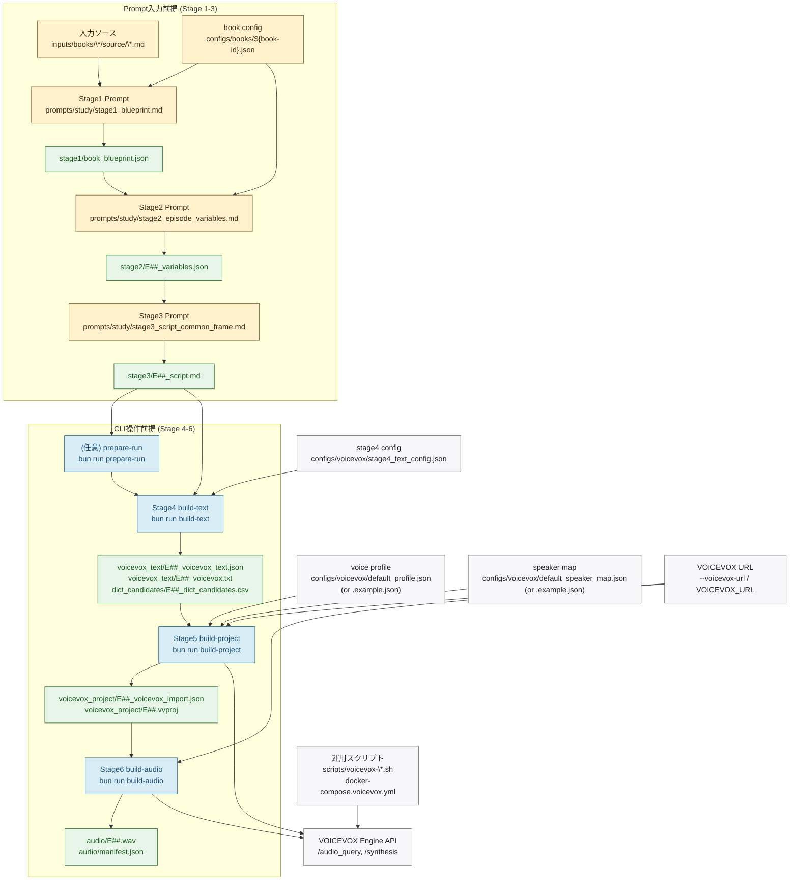

# Pipeline Architecture

最終更新: 2026-02-15

このリポジトリの音声データ生成は、次の2レイヤーで進みます。

- Stage 1-3: `prompts/study/*.md` を別LLMへ渡して生成する「プロンプト入力前提」工程
- Stage 4-6: `bun run ...` で実行する「CLI操作前提」工程

## End-to-End Flow (Mermaid)

## 設定ファイル/入力方式の対応

| 項目 | 主に使う工程 | 前提 | 役割 |
| --- | --- | --- | --- |
| `prompts/study/stage1_blueprint.md` | Stage 1 | プロンプト入力前提 | 書籍全体Blueprintを生成 |
| `prompts/study/stage2_episode_variables.md` | Stage 2 | プロンプト入力前提 | エピソード変数JSONを生成 |
| `prompts/study/stage3_script_common_frame.md` | Stage 3 | プロンプト入力前提 | 固定構成1-8の台本を生成 |
| `configs/books/<book-id>.json` | Stage 1-2 | プロンプト入力前提 | Promptのプレースホルダ値を供給 |
| `configs/voicevox/stage4_text_config.json` | `build-text` | CLI操作前提 | 読み上げやすさ評価とpause計算のしきい値 |
| `configs/voicevox/default_profile.json` | `build-project` | CLI操作前提 | 話者デフォルト値とqueryDefaults |
| `configs/voicevox/default_profile.example.json` | `build-project` | CLI操作前提 | `default_profile.json` 未作成時のフォールバック |
| `configs/voicevox/default_speaker_map.json` | `build-project` | CLI操作前提 | `speaker_key` ごとの声設定 |
| `configs/voicevox/default_speaker_map.example.json` | `build-project` | CLI操作前提 | speaker map の共有テンプレート |
| `--voicevox-url` / `VOICEVOX_URL` | `build-project`/`build-audio` | CLI操作前提 | VOICEVOX Engine接続先を指定 |
| `scripts/voicevox-up.sh` など | Engine起動/疎通確認 | CLI操作前提 | Docker上のVOICEVOX Engine運用補助 |

補足:

- `configs/voicevox/default_speaker_map.yaml` は deprecated プレースホルダです（JSON版を使用）。
- `configs/voicevox/dictionary_rules.yaml` と `configs/voicevox/punctuation_rules.yaml` は planned コメントのみで、現行実装では未参照です。

## CLIでの実データ生成ポイント

| コマンド | 必須入力 | 主な自動推論 | 出力 |
| --- | --- | --- | --- |
| `build-text` | `--script stage3/E##_script.md` | `--run-dir` は `.../run-.../stage3/...` なら推論。`--episode-id` 未指定時はファイル名 `E##_script.md` から推論。 | `voicevox_text/*.json`, `voicevox_text/*.txt`, `dict_candidates/*.csv` |
| `build-project` | `--stage4-json voicevox_text/E##_voicevox_text.json` | `--run-dir` を `.../voicevox_text/...` から推論。profileは `default_profile.json` を優先し、なければ `.example.json`。 | `voicevox_project/*_voicevox_import.json`, `voicevox_project/*.vvproj` |
| `build-audio` | `--stage5-vvproj voicevox_project/E##.vvproj` | `--run-dir` を `.../voicevox_project/...` から推論。 | `audio/E##.wav`, `audio/manifest.json` |

## 現状ステータス

- Stage 1-3 は prompt資産中心（実行は別LLM運用）。
- Stage 4-6 は `src/cli/main.ts` から実行可能。
- `check-run` は Stage 1/2 schema と Stage 3 台本構造（1-8章 + 合計想定時間）を検証する補助コマンド。
