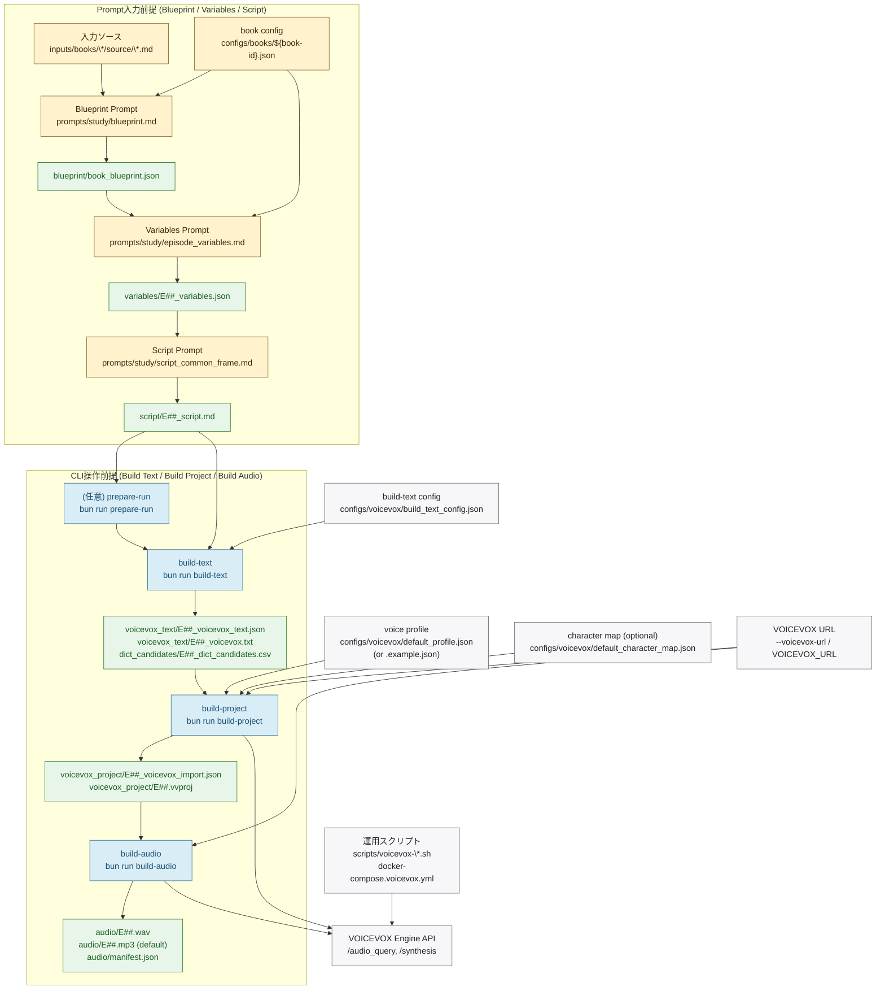

# Pipeline Architecture

最終更新: 2026-02-16

このリポジトリの音声データ生成は、次の2レイヤーで進みます。

- Blueprint / Variables / Script: `prompts/study/*.md` を別LLMへ渡して生成する「プロンプト入力前提」工程
- Build Text / Build Project / Build Audio: `bun run ...` で実行する「CLI操作前提」工程

## End-to-End Flow (Mermaid)

## 設定ファイル/入力方式の対応

| 項目 | 主に使う工程 | 前提 | 役割 |
| --- | --- | --- | --- |
| `prompts/study/blueprint.md` | Blueprint | プロンプト入力前提 | 書籍全体Blueprintを生成 |
| `prompts/study/episode_variables.md` | Episode Variables | プロンプト入力前提 | エピソード変数JSONを生成 |
| `prompts/study/script_common_frame.md` | Script | プロンプト入力前提 | 固定構成1-8の台本を生成 |
| `configs/books/<book-id>.json` | Blueprint / Variables | プロンプト入力前提 | Promptのプレースホルダ値を供給 |
| `configs/voicevox/build_text_config.json` | `build-text` | CLI操作前提 | 読み上げやすさ評価とpause計算のしきい値 |
| `configs/voicevox/default_profile.json` | `build-project` | CLI操作前提 | 話者デフォルト値とqueryDefaults |
| `configs/voicevox/default_profile.example.json` | `build-project` | CLI操作前提 | `default_profile.json` 未作成時のフォールバック |
| `configs/voicevox/default_character_map.json` | `build-project` | CLI操作前提 | `character_key` ごとの声設定（`speaker_key` / `--character-key` 利用時は必須） |
| `--voicevox-url` / `VOICEVOX_URL` | `build-project`/`build-audio` | CLI操作前提 | VOICEVOX Engine接続先を指定 |
| `ffmpeg` (`--ffmpeg-path`) | `build-audio` | CLI操作前提 | WAV を mp3/m4a/ogg へ圧縮変換 |
| `scripts/voicevox-up.sh` など | Engine起動/疎通確認 | CLI操作前提 | Docker上のVOICEVOX Engine運用補助 |

補足:

- `configs/voicevox/dictionary_rules.yaml` と `configs/voicevox/punctuation_rules.yaml` は planned コメントのみで、現行実装では未参照です。

## CLIでの実データ生成ポイント

| コマンド | 必須入力 | 主な自動推論 | 出力 |
| --- | --- | --- | --- |
| `render-prompt` | `--genre`, `--step`, `--book-config` | なし（`variables` のみ `--episode-id` 上書き可） | 解決済みプロンプトを stdout 出力 |
| `build-text` | `--script script/E##_script.md` | `--run-dir` は `.../run-.../script/...` なら推論。`--episode-id` 未指定時はファイル名 `E##_script.md` から推論。 | `voicevox_text/*.json`, `voicevox_text/*.txt`, `dict_candidates/*.csv` |
| `build-project` | `--voicevox-text-json voicevox_text/E##_voicevox_text.json` | `--run-dir` を `.../voicevox_text/...` から推論。profileは `default_profile.json` を優先し、なければ `.example.json`。 | `voicevox_project/*_voicevox_import.json`, `voicevox_project/*.vvproj` |
| `build-audio` | `--vvproj voicevox_project/E##.vvproj` | `--run-dir` を `.../voicevox_project/...` から推論。圧縮は `--compressed-format` / `--compressed-bitrate-kbps` で変更可。 | `audio/E##.wav`, `audio/E##.(mp3|m4a|ogg)`, `audio/manifest.json` |

## 現状ステータス

- Blueprint / Variables / Script は prompt資産中心（`skills/gen-*` または別LLM運用）。
- Build Text / Build Project / Build Audio は `src/cli/main.ts` から実行可能。
- `check-run` は Blueprint/Variables schema と Script 台本構造（1-8章）を検証する補助コマンド。
