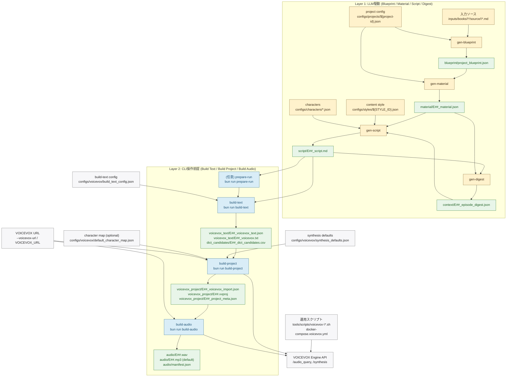

# Pipeline Architecture

最終更新: 2026-02-20

このリポジトリの音声データ生成は、次の2レイヤーで進みます。

- Blueprint / Material / Script / Digest: Skills (`/gen-*`) で LLM を使って生成する「プロンプト入力前提」工程
- Build Text / Build Project / Build Audio: `bun run ...` で実行する「CLI操作前提」工程

## End-to-End Flow (Mermaid)

## 設定ファイル/入力方式の対応

| 項目 | 主に使う工程 | 前提 | 役割 |
| --- | --- | --- | --- |
| `prompts/tech_explainer/blueprint.md` | Blueprint | プロンプト入力前提 | 書籍全体Blueprintを生成 |
| `prompts/tech_explainer/episode_material.md` | Episode Material | プロンプト入力前提 | エピソード素材JSONを生成 |
| `prompts/tech_explainer/script_common_frame.md` | Script | プロンプト入力前提 | 台本を生成（セクション数は演出層が決定） |
| `configs/projects/<project-id>.json` | Blueprint / Material | プロンプト入力前提 | Promptのプレースホルダ値を供給（STYLE_ID, CAST 含む） |
| `configs/styles/<style-id>.json` | Script | プロンプト入力前提 | 「どう語るか」のパラメータ（format, pacing, language 等） |
| `configs/characters/*.json` | Script / Digest | プロンプト入力前提 | キャラクター定義（voice + profile） |
| `configs/voicevox/build_text_config.json` | `build-text` | CLI操作前提 | 読み上げやすさ評価とpause計算のしきい値 |
| `configs/voicevox/synthesis_defaults.json` | `build-project` | CLI操作前提 | `--synthesis-defaults` 未指定時に読み込む query/テンポ既定値 |
| `configs/voicevox/synthesis_defaults.example.json` | `build-project` | CLI操作前提 | テンプレート。利用時は `--synthesis-defaults` で明示指定 |
| `configs/voicevox/default_character_map.json` | `build-project` | CLI操作前提 | `character_key` ごとの声設定（`speaker_key` / `--character-key` 利用時は必須） |
| `--voicevox-url` / `VOICEVOX_URL` | `build-project`/`build-audio` | CLI操作前提 | VOICEVOX Engine接続先を指定 |
| `ffmpeg` (`--ffmpeg-path`) | `build-audio` | CLI操作前提 | WAV を mp3/m4a/ogg へ圧縮変換 |
| `tools/scripts/voicevox-up.sh` など | Engine起動/疎通確認 | CLI操作前提 | Docker上のVOICEVOX Engine運用補助 |

## CLIでの実データ生成ポイント

| コマンド | 必須入力 | 主な自動推論 | 出力 |
| --- | --- | --- | --- |
| `render-prompt` | `--genre`, `--step`, `--project-config` | なし（`material` のみ `--episode-id` 上書き可） | 解決済みプロンプトを stdout 出力 |
| `build-text` | `--script script/E##_script.md` | `--run-dir` は `.../run-.../script/...` なら推論。`--episode-id` 未指定時はファイル名 `E##_script.md` から推論。 | `voicevox_text/*.json`, `voicevox_text/*.txt`, `dict_candidates/*.csv` |
| `build-project` | `--voicevox-text-json voicevox_text/E##_voicevox_text.json` | `--run-dir` を `.../voicevox_text/...` から推論。`--synthesis-defaults` 未指定時は `synthesis_defaults.json` を使用（未作成ならエラー）。 | `voicevox_project/*_voicevox_import.json`, `voicevox_project/*.vvproj`, `voicevox_project/*_project_meta.json` |
| `build-audio` | `--vvproj voicevox_project/E##.vvproj` | `--run-dir` を `.../voicevox_project/...` から推論。圧縮は `--compressed-format` / `--compressed-bitrate-kbps` で変更可。 | `audio/E##.wav`, `audio/E##.(mp3|m4a|ogg)`, `audio/manifest.json` |

補足:

- `build-project` の話者解決は synthesis defaults から voice を解決しません。`speaker_key`/`--character-key` + character map、または `--engine-id`/`--speaker-id`/`--style-id` の3指定が必要です。

## 現状ステータス

- Blueprint / Material / Script / Digest は Skills (`/gen-blueprint`, `/gen-material`, `/gen-script`, `/gen-digest`) で LLM 生成。
- Build Text / Build Project / Build Audio は `src/cli/main.ts` から実行可能。
- `check-run` は Blueprint/Material スキーマ、Digest スキーマ、Script 最低限構造、Style/Cast クロスバリデーションを検証する補助コマンド。
