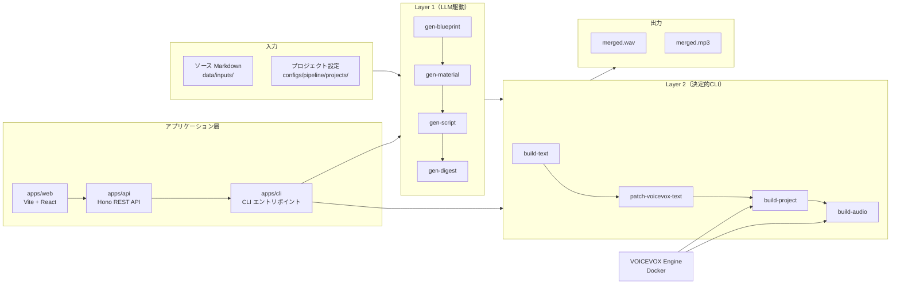

# システム全体概要

## 概要

Narrative Vox は技術書・記事（Markdown）をナレーション台本に変換し、VOICEVOX で音声データを生成するローカルファースト・スキーマ駆動のパイプラインツール。個人開発プロダクトであり、後方互換不要の設計方針に従う。

---

## アーキテクチャ全体図



---

## 主要コンポーネント一覧

| コンポーネント | 場所 | 仕様 |
|---|---|---|
| Layer 1 パイプライン | `apps/cli/` + `prompts/` | [spec-01](./01-pipeline-layer1.md) |
| Layer 2 パイプライン | `packages/application/` | [spec-02](./02-pipeline-layer2.md) |
| データスキーマ（17種） | `schemas/` | [spec-03](./03-data-schemas.md) |
| 設定システム | `configs/` | [spec-04](./04-config-system.md) |
| キャラクター/話者解決 | `packages/domain/` + `configs/content/characters/` | [spec-05](./05-character-voice.md) |
| Run ディレクトリ | `data/projects/` | [spec-06](./06-run-directory.md) |
| REST API + WebSocket | `apps/api/` | [spec-07](./07-api-contracts.md) |
| Web UI（7ページ） | `apps/web/` | [spec-08](./08-web-ui.md) |
| 再設計ワークフロー | `docs/spec/` | [spec-09](./09-redesign-workflow.md) |

---

## テックスタック

| 層 | 技術 |
|---|---|
| ランタイム | Bun（TypeScript を直接実行、ビルド不要） |
| API サーバー | Hono（on Bun） |
| フロントエンド | Vite + React + TanStack Query + Tailwind CSS v4 |
| バリデーション | AJV（JSON Schema 2020-12） |
| LLM | Claude API（Anthropic SDK） |
| 音声合成 | VOICEVOX Engine（Docker） |
| リント/フォーマット | Biome |

---

## データフロー（Run 単位）

```
data/projects/<project-id>/run-YYYYMMDD-HHMM/
├── blueprint/project_blueprint.json   ← gen-blueprint
├── material/E##_material.json         ← gen-material
├── script/E##_script.md               ← gen-script
├── context/E##_episode_digest.json    ← gen-digest
├── voicevox_text/E##_voicevox_text.json    ← build-text
├── voicevox_text/E##_voicevox_text.patched.json  ← patch
├── voicevox_project/E##.vvproj        ← build-project
└── audio/E##_merged.wav               ← build-audio
```

各ステップは Run ディレクトリ内のサブフォルダに成果物を書き込み、次ステップがそれを読み込む。

---

## 設計原則

| 原則 | 内容 |
|---|---|
| **スキーマ駆動** | 全データ構造に JSON Schema が対応。各ステージで AJV バリデーションを実施 |
| **後方互換不要** | リリース前の個人開発のため、破壊的変更は一括切替で行う |
| **ローカル前提** | VOICEVOX Engine はローカル Docker。API は認証なし |
| **決定的 Layer 2** | LLM は Layer 1 のみ。Layer 2 は同一入力から同一出力を保証 |
| **イミュータブル Run** | 再実行は新 Run を作成。既存 Run は上書きしない |

---

## ソース構成（モノレポ）

```
apps/
├── cli/    # CLIエントリポイント（14コマンド）
├── api/    # Hono API サーバー
└── web/    # Vite + React フロントエンド

packages/
├── domain/           # ドメイン型・ルール
├── application/      # ユースケース実装
├── infrastructure/   # 外部I/O（filesystem, VOICEVOX API）
└── quality/          # check-run バリデーション

configs/              # 全設定ファイル
schemas/              # JSON Schema 定義（17ファイル）
prompts/              # LLM プロンプトテンプレート
data/                 # 実行データ（gitignore）
docs/
├── architecture/     # 既存アーキテクチャドキュメント
└── spec/             # 現行仕様スナップショット（このディレクトリ）
```

---

## このドキュメントセットの読み方

### 初読の場合

1. **このファイル**（spec-00）でシステム全体を把握
2. [spec-06: Runディレクトリ](./06-run-directory.md) でデータの流れの基盤を理解
3. [spec-01: Layer 1](./01-pipeline-layer1.md) → [spec-02: Layer 2](./02-pipeline-layer2.md) でパイプラインを把握

### 特定機能を調べる場合

| 調べたいこと | 参照先 |
|---|---|
| スキーマ定義・データ構造 | [spec-03](./03-data-schemas.md) |
| キャラクターと音声の対応 | [spec-05](./05-character-voice.md) |
| 設定ファイルの構造と操作 | [spec-04](./04-config-system.md) |
| API エンドポイント仕様 | [spec-07](./07-api-contracts.md) |
| Web UI のページ構成 | [spec-08](./08-web-ui.md) |

### 再設計・LLM による新仕様生成

[spec-09: 再設計ワークフロー](./09-redesign-workflow.md) を参照。

---

## 関連ドキュメント

- `docs/architecture/` — より詳細なアーキテクチャ解説（実装詳細含む）
- `CLAUDE.md` — Claude Code 向け開発ガイド（コマンド・コミット規約）
