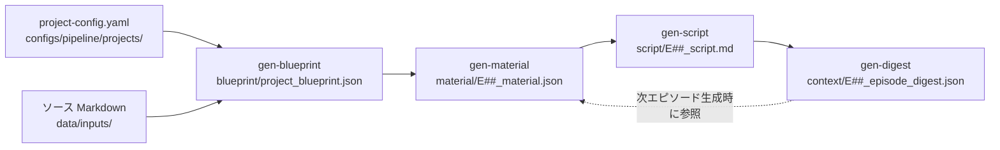

# Layer 1 LLM駆動パイプライン

## 概要

Layer 1 は LLM（Claude API）を使って技術書・記事をナレーション台本に変換する4ステップのパイプライン。`gen-blueprint → gen-material → gen-script → gen-digest` の順に実行し、各ステップの成果物が次ステップの入力となる。全ステップは `apps/cli/src/main.ts` からディスパッチされ、Web UI のパイプラインページからも実行可能。

---

## パイプライン全体フロー



---

## ステップ1: gen-blueprint

### 概要
プロジェクト設定とソース Markdown をもとに、エピソード計画を含むプロジェクト設計図（Blueprint）を生成する。

### 入力
| ファイル | パス |
|---|---|
| プロジェクト設定 | `configs/pipeline/projects/<project-id>.yaml` |
| ソース Markdown | `SOURCE_MARKDOWN_PATHS` で指定されたファイル群 |

### 出力
| ファイル | パス |
|---|---|
| Blueprint JSON | `<run-dir>/blueprint/project_blueprint.json` |

### CLI コマンド
```bash
bun run gen-blueprint -- --project-id <id>
```

> `--project-id` のみ必須。Run ディレクトリは自動生成（`run-YYYYMMDD-HHMM`）。

### プロンプトテンプレート
`prompts/<genre-id>/blueprint.md`（例: `prompts/tech-explainer/blueprint.md`）

### 出力スキーマ
`blueprint.schema.json`（[spec-03 参照](./03-data-schemas.md#blueprintschema-json)）

---

## ステップ2: gen-material

### 概要
Blueprint の1エピソード分と、直前エピソードの Digest（あれば）を参照して Episode Material を生成する。Material はコンテンツ要素（theme_introduction / concept / code_example など）のリスト。

### 入力
| ファイル | パス |
|---|---|
| Blueprint | `<run-dir>/blueprint/project_blueprint.json` |
| プロジェクト設定 | `configs/pipeline/projects/<project-id>.yaml` |
| ソース Markdown | `SOURCE_MARKDOWN_PATHS` 指定ファイル |
| 前エピソード Digest | `<run-dir>/context/E##_episode_digest.json`（任意） |

### 出力
| ファイル | パス |
|---|---|
| Episode Material | `<run-dir>/material/E##_material.json` |

### CLI コマンド
```bash
bun run gen-material -- --project-id <id> --episode-id E01 --run-dir <path>
```

### プロンプトテンプレート
`prompts/<genre-id>/episode-material.md`

### 出力スキーマ
`episode-material.schema.json`

---

## ステップ3: gen-script

### 概要
Episode Material と Style 設定（話者モード・ペース・言語設定）から台本 Markdown を生成する。キャスト情報（役 → キャラクターキー）に基づいて話者タグを付与。

### 入力
| ファイル | パス |
|---|---|
| Episode Material | `<run-dir>/material/E##_material.json` |
| コンテンツスタイル | `configs/content/styles/<style-id>.yaml` |
| キャラクター定義 | `configs/content/characters/*.yaml` |
| 前エピソード Digest 群 | `<run-dir>/context/` 以下（任意） |

### 出力
| ファイル | パス |
|---|---|
| 台本 Markdown | `<run-dir>/script/E##_script.md` |

### CLI コマンド
```bash
bun run gen-script -- --project-id <id> --episode-id E01 --run-dir <path>
```

### プロンプトテンプレート
`prompts/<genre-id>/script-common-frame.md`

### 台本フォーマット

台本は Markdown で以下のパターンに従う。

```markdown
# エピソードタイトル

## 1. セクションタイトル

[speaker:metan] ReScriptとは、OCamlをベースとした言語です。

[speaker:zundamon] えっと、OCamlって何なのだ？

[speaker:metan] 関数型プログラミング言語のひとつよ。

## 2. 次のセクション

[speaker:narrator] では、ReScriptの主な特徴を見ていきましょう。
```

#### セクションヘッダーパターン
```
^\s*(?:#{1,6}\s*)?(\d+)\.\s+(.+)$
```
例: `1. イントロダクション`、`## 2. 核心概念`

#### 話者タグパターン
```
^\s*\[speaker:([a-z][a-z0-9_-]*)\]\s*
```

---

## ステップ4: gen-digest

### 概要
生成済み台本から Episode Digest を作成する。Digest は次エピソードの Material・Script 生成時に参照され、エピソード間の一貫性（キャラクター行動・用語・ストーリースレッド）を維持する。

### 入力
| ファイル | パス |
|---|---|
| 台本 Markdown | `<run-dir>/script/E##_script.md` |
| Blueprint | `<run-dir>/blueprint/project_blueprint.json` |

### 出力
| ファイル | パス |
|---|---|
| Episode Digest | `<run-dir>/context/E##_episode_digest.json` |

### CLI コマンド
```bash
bun run gen-digest -- --project-id <id> --episode-id E01 --run-dir <path>
```

### プロンプトテンプレート
`prompts/<genre-id>/episode-digest.md`

### 出力スキーマ
`episode-digest.schema.json`

---

## 話者モード（speaker_mode）

コンテンツスタイル（`configs/content/styles/<style-id>.yaml`）の `format.speaker_mode` で指定。

| モード | 説明 | 話者タグ |
|---|---|---|
| `monologue` | 単一話者によるナレーション | 任意（省略可） |
| `dialogue` | 2話者の対話形式 | 各行に `[speaker:key]` |
| `panel` | 複数話者のパネル形式 | 各行に `[speaker:key]` |

> [CONSTRAINT] `dialogue` / `panel` モードでは全発話に話者タグが必須。check-run がバリデーション。

---

## ジャンル（GENRE_ID）

プロジェクト設定の `GENRE_ID` によってプロンプトテンプレートのディレクトリが決まる。

| ジャンル | ディレクトリ | 説明 |
|---|---|---|
| `tech-explainer` | `prompts/tech-explainer/` | 技術解説（4ステップすべて対応） |
| `oss-dive` | `prompts/oss-dive/` | OSSコード解説（blueprint/material/script のみ） |
| `audiobook` | `prompts/audiobook/` | 書籍読み上げ（README のみ、未実装） |

> [EXTENSIBLE] `prompts/<genre-id>/` ディレクトリを追加することで新ジャンルを追加可能。

---

## render-prompt コマンド

LLM に送信するプロンプトをファイルに書き出すデバッグ用コマンド。

```bash
bun run render-prompt -- \
  --genre tech-explainer \
  --step blueprint \
  --project-config configs/pipeline/projects/introducing-rescript.yaml \
  --episode-id E01
```

---

## 自動推論ルール

| フラグ | 推論元 |
|---|---|
| `--run-dir` | 省略時は新規 Run を作成（gen-blueprint のみ） |
| `--episode-id` | `--run-dir` 配下のファイルから推論 |
| `--project-id` | `--run-dir` のパスから推論（`data/projects/<id>/...`） |

---

## 関連仕様

- [spec-03: データスキーマ](./03-data-schemas.md) — blueprint / episode-material / episode-digest スキーマ
- [spec-06: Runディレクトリ](./06-run-directory.md) — 成果物の格納先構造
- [spec-04: 設定システム](./04-config-system.md) — ジャンル・スタイル・キャスト設定
