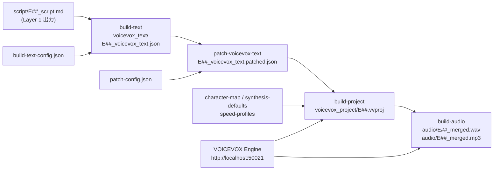

# Layer 2 決定的CLIパイプライン

## 概要

Layer 2 は台本 Markdown から VOICEVOX 音声データを生成する決定的（LLM 不使用）な4ステップパイプライン。`build-text → patch-voicevox-text → build-project → build-audio` の順に実行する。`build-all` コマンドでこれらを一括実行可能。

---

## パイプライン全体フロー



---

## ステップ1: build-text

### 概要
台本 Markdown を解析し、発話ごとの VOICEVOX テキスト JSON（`voicevox_text`）を生成する。文章分割・ポーズ長算出・Speakability スコア計算・辞書候補抽出を行う。

### CLI コマンド
```bash
bun run build-text -- --script data/projects/<id>/<run>/script/E01_script.md
```

### 入力
- `--script`: 台本 Markdown パス（必須）
- `--build-text-config`: 設定ファイルパス（省略可）
- `--run-dir`, `--episode-id`, `--project-id`, `--run-id`: 自動推論可能

### 出力
| ファイル | パス |
|---|---|
| VOICEVOX テキスト JSON | `voicevox_text/E##_voicevox_text.json` |
| 辞書候補 JSON | `dict_candidates/E##_dict_candidates.json` |

### 文章分割アルゴリズム

```
入力: 台本の1行（話者タグ + テキスト）

1. 話者タグ [speaker:key] をパース → speakerKey を抽出
2. 行を文単位に分割（splitIntoSentences）:
   - 句読点（。、！？）で分割
   - ルビ記法 {漢字|よみ} を保持したまま分割
   - 最大200文字を超えないよう調整
3. 各文にポーズ長を計算（decidePauseLengthMs）
4. 発話 ID（U001, U002...）を付番
```

### ポーズ長算出（decidePauseLengthMs）

```
base = 190ms（デフォルト）

文末パターンによる上書き:
  - 句点（。）または読点（、）の後: base = 320ms（fullStop）
  - ！や？（強い語尾）: base = 360ms（strongEnding）
  - 読点（、）: base = 240ms（clauseEnd）

長さボーナス（文字数が多いほど追加）:
  - step=10文字ごとに +20ms、最大 +120ms

接続詞ペナルティ（次文が接続詞始まり）:
  - -40ms（conjunction）

継続ペナルティ（〜が/〜を/〜は で終わる）:
  - -50ms（continuation）

clamp: [120ms, 520ms]
```

### Speakability スコア（0〜100点）

```
score = 100
  - averagePenalty: |average_chars - 32| × 1.2 ← max 35点減点
  - longRatio: long_utterance_ratio × 45（long = 50文字超）
  - punctuationPenalty: (1 - terminal_punctuation_ratio) × 20

閾値（デフォルト）:
  - score ≥ 70（scoreThreshold）
  - terminal_punctuation_ratio ≥ 0.8
  - long_utterance_ratio ≤ 0.25
```

スコアが閾値を下回ると `warnings` 配列に警告が追加される。

### ルビ記法

```
{漢字|よみ} 形式で台本内に記述
例: {音声合成|おんせいごうせい}
```

build-text はルビを辞書候補として抽出し、テキストから除去してプレーンテキスト化する。

---

## ステップ2: patch-voicevox-text

### 概要
`voicevox_text.json` に対して正規化ルール・辞書パッチを適用し、`.patched.json` を生成する。

### CLI コマンド
```bash
bun run patch-voicevox-text -- \
  --voicevox-text-json data/projects/<id>/<run>/voicevox_text/E01_voicevox_text.json
```

### パッチ設定（configs/voice/voicevox/patch-config.json）

**テキスト正規化ルール**（正規表現置換）:

| ルール名 | 変換例 |
|---|---|
| `url` | URL → ユーアールエル |
| `inline_code_strip` | バッククォート除去 |
| `number_ms` | `100ms` → `100ミリ秒` |
| `number_px` | `24px` → `24ピクセル` |
| `number_kb/mb/gb` | `1.5MB` → `1.5メガバイト` |
| `number_hz/khz` | `44100Hz` → `44100ヘルツ` |
| `number_fps` | `60fps` → `60フレーム毎秒` |
| `arrow_right` | `->` / `→` → `から` |

**辞書パッチ**:
- `force_readings`: 特定単語の読みを強制（例: `API` → `エーピーアイ`）
- `suppress_surfaces`: 特定単語を辞書候補から除外

---

## ステップ3: build-project

### 概要
VOICEVOX テキスト JSON から VOICEVOX プロジェクト（`.vvproj`）を生成する。各発話について VOICEVOX Engine に `audio_query` を送り、アクセント・イントネーション情報を取得して埋め込む。

### CLI コマンド
```bash
bun run build-project -- \
  --voicevox-text-json data/projects/<id>/<run>/voicevox_text/E01_voicevox_text.patched.json
```

### 主なオプション
| フラグ | 説明 |
|---|---|
| `--use-patched` | `.patched.json` を自動選択（フラグのみ、値なし） |
| `--speed-preset` | `slow` / `normal` / `fast` |
| `--emotion` | 感情スタイル名（例: `calm`, `energetic`） |
| `--intonation-scale` | イントネーションスケール（浮動小数） |
| `--character-map` | キャラクターマップ JSON のパス |
| `--voicevox-url` | VOICEVOX Engine の URL |

### VOICEVOX Engine 呼び出し

```
発話ごとに:
1. POST /audio_query?text=<text>&speaker=<styleId>
   → AudioQuery（アクセント・イントネーション情報）を取得
2. speed-profiles から --speed-preset の係数を適用
3. AudioQuery を .vvproj の audioItems[utterance_id].query に格納
```

### 速度プリセット適用

| プリセット | speedScale | pauseLengthScale | postPhonemeLength |
|---|---|---|---|
| `slow` | 0.9 | 1.2 | 0.14 |
| `normal` | 1.0 | 1.0 | 0.10 |
| `fast` | 1.15 | 0.9 | 0.08 |

---

## ステップ4: build-audio

### 概要
`.vvproj` を使って各発話の WAV を生成し、エピソード単位で結合する。オプションで MP3/M4A/OGG に圧縮する。

### CLI コマンド
```bash
bun run build-audio -- --vvproj data/projects/<id>/<run>/voicevox_project/E01.vvproj
```

### 主なオプション
| フラグ | 説明 | デフォルト |
|---|---|---|
| `--compressed-format` | `mp3` / `m4a` / `ogg` / `none` | `mp3` |
| `--compressed-bitrate-kbps` | 圧縮ビットレート | 128 |
| `--voicevox-url` | VOICEVOX Engine URL | `http://localhost:50021` |

### 処理フロー

```
発話ごとに:
1. POST /synthesis?speaker=<styleId> with AudioQuery
   → WAV バイナリを取得
2. audio/E##/U###.wav として保存

全発話完了後:
3. WAV ファイルを utterance_id 順に連結
4. audio/E##_merged.wav として保存
5. ffmpeg で MP3 圧縮（--compressed-format が none 以外）
6. audio/E##_audio_manifest.json を書き込み
```

### エラーハンドリング

```typescript
interface BuildAudioFailure {
  audioKey: string;              // 発話 ID
  stage: "audio_query" | "synthesis";
  message: string;
  statusCode?: number;           // HTTP ステータス
  attempts: number;
  retriable: boolean;            // リトライ可否
}
```

失敗した発話は記録されるが、成功した発話の処理は継続する（部分的な成果物が生成される）。

### 音声マニフェスト（audio_manifest.json）

```json
{
  "episodeId": "E01",
  "utteranceCount": 48,
  "successCount": 48,
  "failureCount": 0,
  "failures": [],
  "mergedWavPath": "audio/E01_merged.wav",
  "compressedAudioPath": "audio/E01_merged.mp3",
  "compression": {
    "format": "mp3",
    "bitrate": 128,
    "status": "succeeded"
  }
}
```

---

## build-all（一括実行）

```bash
bun run build-all -- --script data/projects/<id>/<run>/script/E01_script.md
```

`build-text → patch-voicevox-text → build-project → build-audio` を順次実行する。

| フラグ | 説明 |
|---|---|
| `--script` | 台本パス（必須） |
| `--patch` | パッチを適用する（フラグのみ） |
| `--patch-config` | パッチ設定のパス |

---

## 自動推論ルール

Layer 2 の各コマンドは多くのフラグを自動推論できる。

| フラグ | 推論元 |
|---|---|
| `--run-dir` | `--script` / `--voicevox-text-json` / `--vvproj` のパスから抽出 |
| `--episode-id` | ファイル名から抽出（`E01_script.md` → `E01`） |
| `--project-id` | `--run-dir` のパスから抽出 |
| `--voicevox-url` | 環境変数 `VOICEVOX_API_URL`、デフォルト `http://127.0.0.1:50021` |

---

## VOICEVOX Engine 設定

| 項目 | デフォルト | 環境変数 |
|---|---|---|
| URL | `http://127.0.0.1:50021` | `VOICEVOX_API_URL` |
| Docker イメージ | `voicevox/voicevox_engine` | — |
| 起動確認 | `bun run voicevox:check` | — |

> [CONSTRAINT] VOICEVOX Engine はローカルで動作している必要がある。リモートホストへのアクセスは API バリデーションで制限される（ローカルアドレスのみ許可）。

---

## check-run

全ステージの成果物をスキーマ＋構造バリデーションする品質チェックコマンド。

```bash
bun run check-run -- --run-dir data/projects/<id>/<run>
```

### バリデーション内容

| 対象 | チェック内容 |
|---|---|
| `run-contract.json` | スキーマ適合 |
| `blueprint/` | スキーマ適合 |
| `material/E##` | スキーマ適合、要素数が0でないこと |
| `script/E##` | 空でないこと、セクション見出しが存在すること、`speaker_mode` に応じた話者タグの存在 |
| `voicevox_text/E##` | スキーマ適合、Speakability 閾値以上 |

---

## 関連仕様

- [spec-03: データスキーマ](./03-data-schemas.md) — voicevox-text / voicevox-import スキーマ
- [spec-05: キャラクター/話者解決](./05-character-voice.md) — build-project の話者解決
- [spec-06: Runディレクトリ](./06-run-directory.md) — 成果物格納先
- [spec-07: API コントラクト](./07-api-contracts.md) — POST /api/pipeline/run でのコマンド実行
