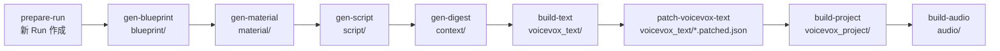

# Runディレクトリ構造とライフサイクル

## 概要

Narrative Vox の全パイプライン成果物は「Run」と呼ばれる実行単位に格納される。Run は `data/projects/<project-id>/run-YYYYMMDD-HHMM/` 以下のディレクトリ構造として存在し、Layer 1〜2 の各ステップが順に成果物を書き込む。Run はイミュータブルに扱われ、再実行時は新しい Run を作成する。

---

## ディレクトリ完全構造

```
data/
└── projects/
    └── <project-id>/               # プロジェクト ID（例: introducing-rescript）
        └── run-YYYYMMDD-HHMM/      # Run ディレクトリ（例: run-20260301-1430）
            ├── run-contract.json   # Run メタデータ（必須）
            ├── blueprint/
            │   └── project_blueprint.json
            ├── material/
            │   └── E##_material.json           # エピソードごと
            ├── script/
            │   └── E##_script.md               # エピソードごと
            ├── context/
            │   └── E##_episode_digest.json     # エピソードごと
            ├── voicevox_text/
            │   ├── E##_voicevox_text.json
            │   └── E##_voicevox_text.patched.json  # patch 後（任意）
            ├── dict_candidates/
            │   └── E##_dict_candidates.json    # 辞書候補（任意）
            ├── voicevox_project/
            │   └── E##.vvproj                  # VOICEVOX プロジェクト
            └── audio/
                ├── E##/
                │   ├── U001.wav                # 発話ごとの WAV
                │   ├── U002.wav
                │   └── ...
                ├── E##_merged.wav              # エピソード結合 WAV
                ├── E##_merged.mp3              # 圧縮音声（任意）
                └── E##_audio_manifest.json     # 音声生成マニフェスト
```

---

## Run ID 命名規則

| 項目 | 値 |
|---|---|
| フォーマット | `run-YYYYMMDD-HHMM` |
| 例 | `run-20260301-1430` |
| 正規表現 | `^run-\d{8}-\d{4}$` |
| 生成関数 | `makeRunIdNow()`（現在時刻から生成） |
| 推論 | `resolveRunId()` がパスのセグメントから自動検出 |

Run ID から作成日時を復元できる（`run-20260301-1430` → `2026-03-01T14:30:00Z`）。

---

## プロジェクト ID 命名規則

| 項目 | 値 |
|---|---|
| フォーマット | 小文字英数字・ハイフン・アンダースコア |
| 正規表現 | `^[a-z0-9][a-z0-9_-]*$` |
| 例 | `introducing-rescript`, `tech-explainer-01` |

---

## エピソード ID 命名規則

| 項目 | 値 |
|---|---|
| フォーマット | `E` + 2桁ゼロ埋め数字 |
| 正規表現 | `^E\d{2}$` |
| 例 | `E01`, `E02`, `E10` |
| 用途 | ファイル名プレフィックス（`E01_script.md`）、CLIフラグ（`--episode-id E01`） |

---

## RunContract 構造

Run の作成時に `run-contract.json` として書き込まれるメタデータ。

### 最小実例
```json
{
  "version": 1,
  "projectId": "introducing-rescript",
  "runId": "run-20260301-1430",
  "runDir": "data/projects/introducing-rescript/run-20260301-1430",
  "createdAt": "2026-03-01T14:30:00.000Z"
}
```

### フィールド定義

| フィールド | 型 | 説明 |
|---|---|---|
| `version` | `1`（固定） | コントラクトバージョン |
| `projectId` | `string` | プロジェクト ID（パターン: `^[a-z0-9][a-z0-9_-]*$`） |
| `runId` | `string` | Run ID（パターン: `^run-\d{8}-\d{4}$`） |
| `runDir` | `string` | Run ディレクトリの相対パス |
| `createdAt` | ISO 8601 | 作成日時（UTC） |

> [CONSTRAINT] `version` は現時点で `1` 固定。スキーマ変更時はバージョンを上げる。

---

## RunStatus API レスポンス

`GET /api/runs/:projectId/:runId/status` が返す RunStatus 型。ファイルの存在から状態を動的に導出する。

```json
{
  "projectId": "introducing-rescript",
  "runId": "run-20260301-1430",
  "plannedEpisodeIds": ["E01", "E02"],
  "stages": {
    "blueprint": { "status": "completed" },
    "material":  { "status": "partial", "episodeIds": ["E01"] },
    "script":    { "status": "idle", "episodeIds": [] },
    "context":   { "status": "idle", "episodeIds": [] },
    "voicevox_text":    { "status": "idle" },
    "voicevox_project": { "status": "idle" },
    "audio":     { "status": "idle" }
  }
}
```

### ステージ状態値

| 値 | 意味 |
|---|---|
| `"idle"` | 成果物なし（未実行） |
| `"partial"` | 一部エピソードのみ完了 |
| `"completed"` | 全エピソード完了（または blueprint のように単一ファイルが存在） |

### ステージとファイルの対応

| ステージ | 対応ファイル | 検出サフィックス |
|---|---|---|
| `blueprint` | `blueprint/project_blueprint.json` | ファイル存在確認 |
| `material` | `material/E##_material.json` | `_material.json` |
| `script` | `script/E##_script.md` | `_script.md` |
| `context` | `context/E##_episode_digest.json` | `_episode_digest.json` |
| `voicevox_text` | `voicevox_text/E##_voicevox_text.json` | `_voicevox_text.json` |
| `voicevox_project` | `voicevox_project/E##.vvproj` | `.vvproj` |
| `audio` | `audio/E##_merged.wav` 等 | `.wav` |

> [CONSTRAINT] `plannedEpisodeIds` は `blueprint/project_blueprint.json` の `episode_plan[].episode_id` から読み込む。Blueprint 未作成時は空配列。

---

## prepare-run によるクローン仕様

既存 Run から設定ファイルのみをコピーして新しい Run を初期化するコマンド。

```bash
bun run prepare-run -- --source-run-dir data/projects/<id>/run-YYYYMMDD-HHMM
```

### コピーされるファイル

| コピー元 | コピー先 | 説明 |
|---|---|---|
| `run-contract.json` | 新 Run の `run-contract.json`（runId/createdAt 更新） | メタデータ |
| ソース Run のその他成果物 | コピーしない | LLM成果物は引き継がない |

> [EXTENSIBLE] コピー対象ファイルは将来拡張可能（例: blueprint や material も引き継ぐモード）。

---

## Run ライフサイクル



各ステップは前のステップの成果物を入力として受け取る。`build-all` は `build-text → patch → build-project → build-audio` を一括実行する。

---

## ファイルアクセスのセキュリティ境界

APIサーバーはパストラバーサル対策として全ファイルパスを `safeResolve()` でバリデーション。

- `data/projects/<projectId>/<runId>/` 以下のみアクセス可能
- `..` セグメントは拒否（`SafePathError` → HTTP 403）
- 絶対パスは拒否
- テキストファイルのみ読み取り可能（`.json`, `.md`, `.txt` など）
- 書き込み可能なのは `E##_voicevox_text.json` のみ（ETag 必須）

---

## 関連仕様

- [spec-01: Layer 1 パイプライン](./01-pipeline-layer1.md) — blueprint/material/script/digest の生成
- [spec-02: Layer 2 パイプライン](./02-pipeline-layer2.md) — voicevox_text/project/audio の生成
- [spec-03: データスキーマ](./03-data-schemas.md) — 各 JSON ファイルのスキーマ定義
- [spec-07: API コントラクト](./07-api-contracts.md) — /api/runs エンドポイント詳細
