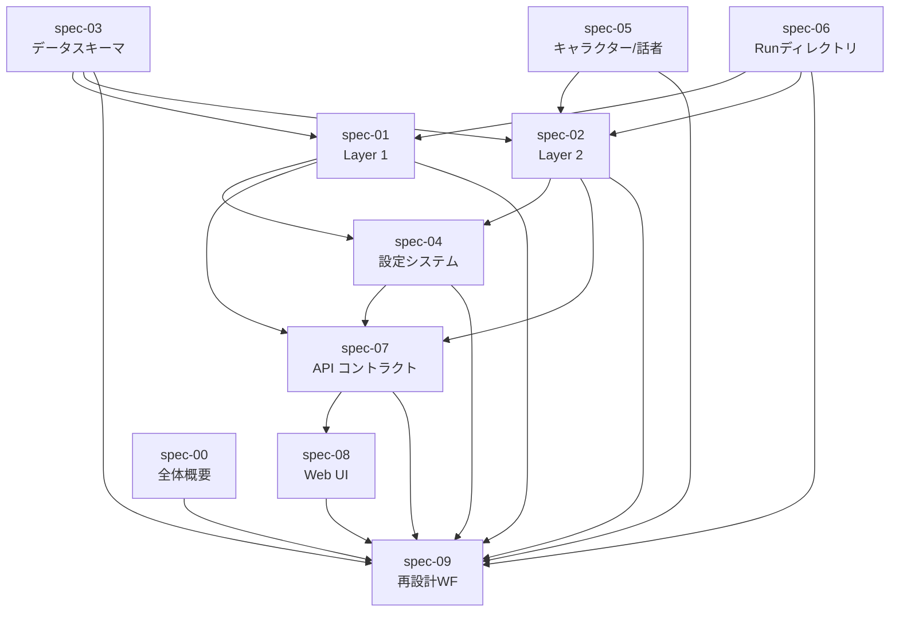

# 再設計ワークフロー（メタドキュメント）

## 概要

このドキュメントは `docs/spec/` を「現行仕様スナップショット」として活用し、LLM に新仕様書・新デザインを生成させるためのメタドキュメント。変更仕様書（`CHANGE-*.md`）のフォーマットと、新仕様書・新 `.pen` ファイル生成のプロンプト雛形を定義する。

---

## spec ファイル間の依存関係マップ



---

## 変更仕様書テンプレート

`docs/spec/CHANGE-<topic>.md` として作成する。

```markdown
---
change-id: change-<topic>
title: <変更の概要>
created: YYYY-MM-DD
affects: [spec-XX, spec-YY]
breaking: true | false
---

# <変更タイトル>

## 変更の目的
（なぜこの変更が必要か、1〜3文で記述）

## 変更内容

### 削除するもの
- `<既存の要素>`: <理由>

### 追加するもの
- `<新しい要素>`: <目的と概要>

### 変更するもの
- `<既存の要素>` → `<新しい値/構造>`: <変更理由>

## 影響範囲

| spec | 変更内容の概要 |
|---|---|
| spec-XX | ... |
| spec-YY | ... |

## 非互換事項
（breaking: true の場合のみ記述）
- 既存の <成果物/API/設定> との互換性がなくなる

## 移行手順
（必要な場合のみ記述）
1. ...
2. ...
```

---

## 新仕様書生成プロンプト雛形

以下のプロンプトを LLM に送ることで、変更仕様書に基づいた新しい spec ファイルを生成できる。

```
あなたは Narrative Vox のシステム設計者です。
以下の現行仕様書と変更仕様書を読んで、更新後の仕様書を生成してください。

## 現行仕様書

### spec-XX: <タイトル>
<docs/spec/XX-*.md の全文>

### spec-YY: <タイトル>
<docs/spec/YY-*.md の全文>

## 変更仕様書

<docs/spec/CHANGE-<topic>.md の全文>

## 指示

上記の変更仕様書に従って、以下のファイルを更新してください:
- docs/spec/XX-<name>.md（<変更の概要>）

更新後の仕様書を出力してください。フォーマットは元の spec ファイルと同じ形式（YAML フロントマター + Markdown）を保ってください。変更されない箇所は元の文章をそのまま維持してください。
```

---

## UI デザイン生成手順

新しい `08-web-ui.md` が完成した後、Pencil MCP で `.pen` ファイルを更新する手順。

### ステップ1: 変更仕様書の確認

`CHANGE-web-ui.md` で変更されるページ・コンポーネントを把握する。

### ステップ2: スタイルガイドの取得

```
1. mcp__pencil__get_style_guide_tags() でタグ一覧取得
2. mcp__pencil__get_style_guide(tags=[...]) でスタイルガイド取得
3. mcp__pencil__get_guidelines(topic="design-system") でデザインルール取得
```

### ステップ3: 既存デザインの読み込み

```
mcp__pencil__get_editor_state()
→ design/frontend-console.pen を開く
```

### ステップ4: 新しい仕様書からデザインを生成

`08-web-ui.md` の各ページ仕様を参照して `batch_design()` で設計。

### ステップ5: スクリーンショットで検証

```
mcp__pencil__get_screenshot(nodeId) で各ページを確認
```

---

## このドキュメントセットの役割分担

| ディレクトリ | 役割 | 更新タイミング |
|---|---|---|
| `docs/architecture/` | 実装詳細・設計決定の記録 | 実装後（事後） |
| `docs/spec/` | 再設計用現行スナップショット | 大規模変更前（事前）|
| `docs/spec/CHANGE-*.md` | 変更仕様書 | 変更検討時（事前） |

`docs/architecture/` と `docs/spec/` は独立管理。`docs/spec/` は「今このシステムはこう動いている」の記述であり、`docs/architecture/` は「なぜこの設計になったか」の記述。

---

## 既存 docs/architecture/ との関係

| ファイル | docs/architecture/ での対応 |
|---|---|
| spec-02: Layer 2 | `build-text-speakability-checklist.md` |
| spec-05: キャラクター | `character-voice-resolution.md`（あれば） |
| spec-06: Run ディレクトリ | `run-directory.md`（あれば） |

`docs/spec/` は `docs/architecture/` よりも「LLM が読んで新仕様を生成できる」ことを優先した構造化表現。

---

## 変更仕様書の例

### 例: Layer 2 に新ステップを追加する場合

```markdown
---
change-id: change-add-subtitle-export
title: 字幕エクスポート機能の追加
created: 2026-06-01
affects: [spec-02, spec-06, spec-07, spec-08]
breaking: false
---

# 字幕エクスポート機能の追加

## 変更の目的
生成した音声に対応する SRT/VTT 形式の字幕ファイルを自動生成する。

## 変更内容

### 追加するもの
- `export-subtitle` コマンド: voicevox_text.json + audio_manifest.json → SRT/VTT
- `subtitle/E##.srt` および `subtitle/E##.vtt` の Run ディレクトリへの追加

### 変更するもの
- spec-06: Run ディレクトリに `subtitle/` サブフォルダを追加
- spec-07: `ALLOWED_COMMANDS` に `"export-subtitle"` を追加
- spec-08: PipelineUtilityPanel に字幕エクスポートボタンを追加

## 影響範囲
| spec | 変更内容 |
|---|---|
| spec-02 | export-subtitle ステップの追加 |
| spec-06 | subtitle/ ディレクトリの追加 |
| spec-07 | export-subtitle を ALLOWED_COMMANDS に追加 |
| spec-08 | Utility パネルへのボタン追加 |
```

---

## 注意事項

- `docs/spec/` ファイルを直接 LLM で生成・更新した場合、コードとの乖離が生じることがある。定期的に実コードと照合して正確性を保つこと。
- `CHANGE-*.md` は作業完了後も削除せず、変更履歴として残す。
- 仕様書は日本語、コード・スキーマ・プロパティ名は英語のまま記述する。
